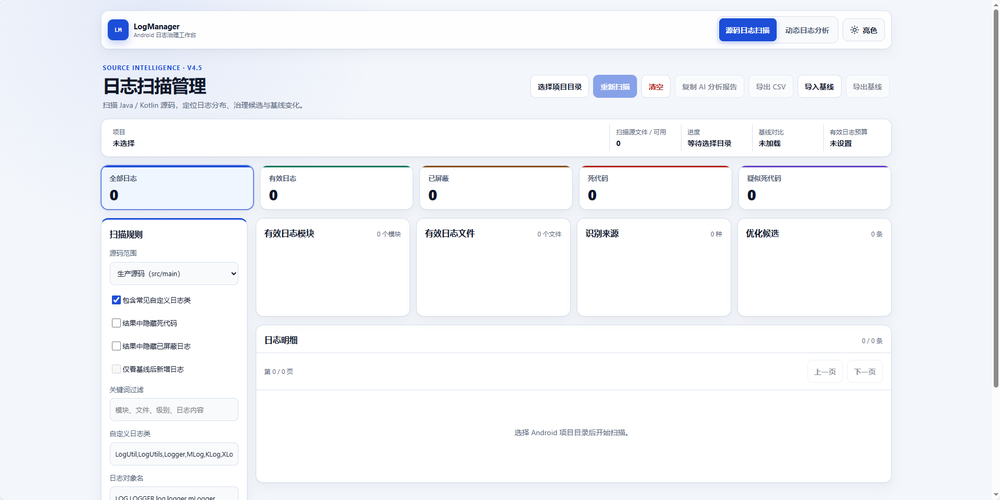
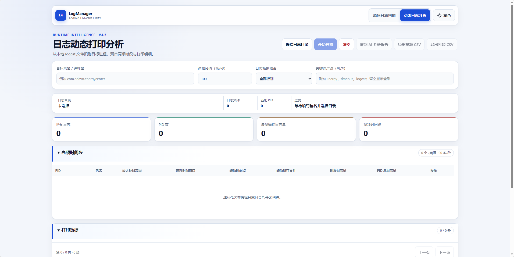

# 日志扫描管理 V4.5

[English](README.md) | [简体中文](README.zh-CN.md)

日志扫描管理 V4.5 是无依赖的 Android 项目日志治理工具。推荐直接打开输出目录中的 `LogScope-V4.html`；它已内联 CSS 和 JavaScript，可单文件分发。

打开 `index.html` 并选择 Android 项目目录，工具默认扫描生产源码 `src/main`。可以切换“全部源码集”，或选择“main + 指定 source set”；切换后会自动重新扫描。顶部“扫描源文件 / 可用”用于核对当前统计范围。

V4.5 支持 Android Log、静态导入与 Kotlin 别名、Timber、System.out/err、Logger API、自定义日志类和方法。每条明细及 CSV 都包含识别来源与 source set。

顶部可以在“源码日志扫描”和“动态日志分析”两个主页间切换，切换时不会清除另一页的输入和结果。

## 界面截图

### 源码日志扫描

选择 Android 项目目录并配置源码范围和识别规则后，可查看分类统计、模块与文件排行、优化候选以及可展开的日志明细。顶部操作区还支持重新扫描、清空、复制 AI 分析报告、导出 CSV 和导入/导出基线。



### 动态日志分析

选择已保存的日志目录，填写目标包名或进程名，并配置高频阈值、日志级别和可选关键词。页面会汇总匹配 PID 与峰值速率，列出高频时间段，并提供筛选后的打印明细、CSV 导出和 AI 分析。



## 动态日志分析

填写目标包名或进程名，选择包含 `.log`、`.txt` 的日志目录，再设置高频阈值（默认 100 条/秒）。工具先从进程启动记录或带包名的日志行映射 PID，再按秒统计目标 PID；连续达到阈值的秒会合并成高频时间段。

结果显示 PID、最大秒日志量、高频时间窗口、峰值时间点、峰值文件、时段日志量和 PID 总日志量。点击“查看打印”后，可用日志级别预设或关键词筛选该时段的时间、PID/TID、级别、TAG、内容和文件位置；关键词留空表示全部。高频汇总和当前打印数据均可导出 CSV。

当前支持常见 Android threadtime 格式及带年份的同类格式。日志中无法建立包名与 PID 对应关系时会明确报错，不会把无法识别显示为零结果。此功能分析已保存的日志目录，不执行 ADB 实时抓取。

## 更新说明

### V4.5（2026-08-28）

- 新增 Android 本地动态日志分析，支持包名到 PID 映射、高频时段聚合、级别与关键词筛选，并可分别导出高频时段和打印明细 CSV。
- 源码与动态分析结果均可一键生成提交给 AI 的优化分析请求文本，支持复制到剪贴板，并在不可用时回退下载 Markdown。
- 源码和动态打印明细改为可折叠日志卡片，完整内容经过安全转义，支持单条复制，并将分页移到结果列表顶部。
- 源码和动态工作区新增独立清空操作，双主页切换时保留各自输入和结果。
- 更新响应式界面，支持亮色/暗色主题记忆，并完善键盘操作、跳转主要内容和减少动画等无障碍体验。

### V4.2（2026-08-20）

- 修复已屏蔽、死代码和疑似死代码的统计显示；注释中的日志调用现计入“已屏蔽”。
- 增加项目扫描进度条，扫描期间锁定相关规则控件，避免统计口径中途变化。
- 日志明细同时显示当前筛选数量和扫描总数。
- 有效日志文件排行显示文件名及末三级路径，重名文件更易区分。
- 切换“包含常见自定义日志类”后自动重新扫描。

## 基线与预算

1. 扫描完成后点击“导出基线”。
2. 后续扫描通过“导入基线”加载 JSON，可查看新增、已有和移除数量，并可勾选“仅看基线后新增日志”。
3. “有效日志预算”填写非负整数；超出后页面会显示差额。

基线使用文件、识别来源和日志调用对比，不使用行号，因此单纯移动代码行不会制造假新增。导入文件限制为 25 MB、250000 条日志，并验证格式。

## CI 命令行

需要 Node.js 18 或更高版本：

```text
node scan-cli.mjs D:\AndroidProject --scope main --format json --output log-report.json --budget 500
```

`--scope` 支持 `main`、`all`、`source:debug`；`--format` 支持 `json`、`csv`。预算超限返回退出码 `2`，参数或项目错误返回 `1`。

单个文件读取失败不会中断整批扫描。日志明细固定每页 50 条，可使用上一页/下一页浏览；长日志默认折叠为 3 行，点击“展开”查看完整调用，展开内容超过 320px 时在单元格内滚动。CSV 始终导出当前筛选的全部结果，不受分页影响。

分析边界：用户要求直接跳到第四阶段，因此第三阶段的 Gradle Variant 组合解析、完整 Java/Kotlin AST 和 R8 可达性分析仍未实现。source set 根据路径判断，死代码采用高置信启发式，不确定情况不会静默排除。
